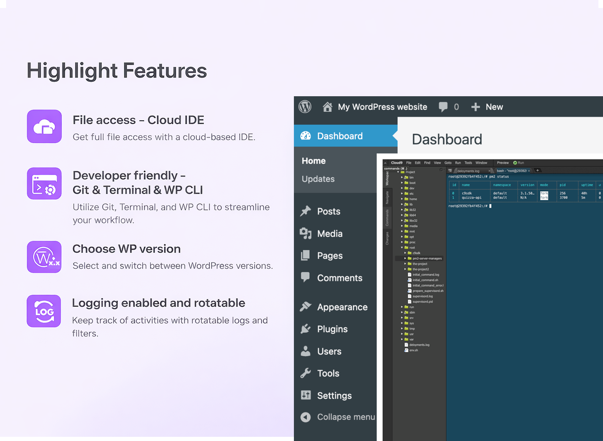
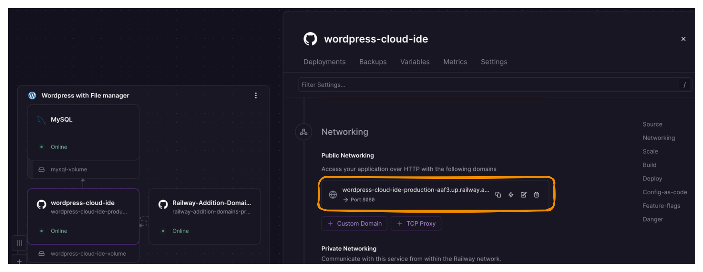
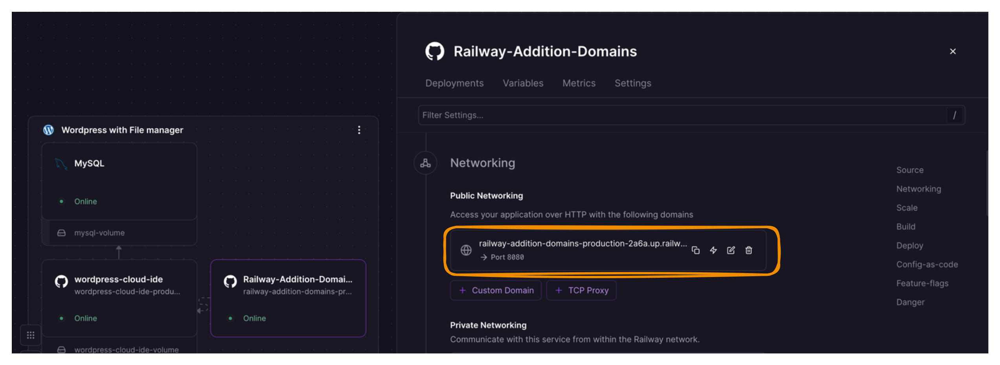
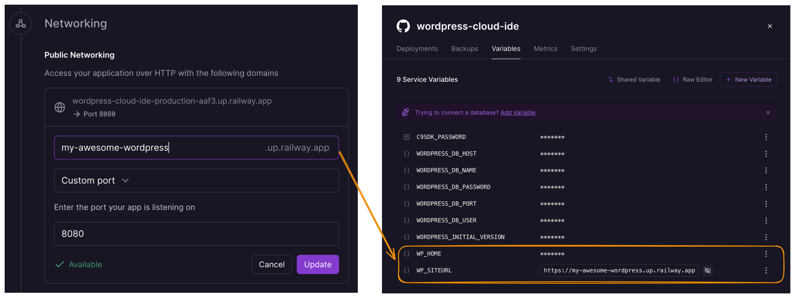

# Wordpress with File manager (Railway Template)



This template run latest Wordpress verions with developer-friendly experience
- File manager via Cloud9 IDE
- Full access to terminal and WP CLI
- Debug log enabled and rotatable
- Bundled with multiple dev tools (Git, zip, unzip, nodejs, pm2)
- Seamless deployment experience for non-tech users

Docker image that serves **WordPress** via **nginx + PHP-FPM** on port **8080**, plus a bundled **c9sdk** (Cloud9) file manager/server started via **pm2**.

## Deployments and Domains

### Default domains

After the template is deployed, you can click the domain in networking section of **wordpress-cloud-ide** and begin the installation there




To access the Cloud9 IDE, navigate to **Railway Addition Domains** container and click the domain there



### Add/Change domains

You can change the default domain provided by Railway, or you can add your custom domain and point it to port 8080. After that, you need to add WP_HOME and WP_SITEURL to prevent wordpress keep redirecting to the old urls



## Notes

- WordPress debug log is saved to `/var/log/wordpress/debug.log`, and it is rotated daily via cron, with rotated files older than 7 days automatically removed.
- You can install previous Wordpress versios by using `WORDPRESS_INITIAL_VERSION`. But please make sure to do that before any deployment. It will skip if the volume is not empty
- instructions to use WP CLI: you need to open Cloud9 IDE and open a terminal there

```bash
su -s /bin/bash www-data
cd /var/www/html/wordpress
wp core version
```